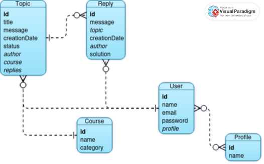

# ⁉️ Boas-vindas ao repositório do projeto ForumHub! 💬
<p align="center">
     <a alt="Java" href="https://java.com" target="_blank">
        
    </a>
    <a alt="Spring Boot" href="https://spring.io/" target="_blank">
        
    </a>
     <a alt="Maven" href="https://maven.apache.org/index.html" target="_blank">
        
    </a>
    <a alt="MySQL" href="https://www.mysql.com/" target="_blank">
        
    </a>
        <a alt="Lombok" href="https://projectlombok.org/" target="_blank">
        
    </a>
     <a alt="IntelliJ IDEA" href="https://www.jetbrains.com/idea/" target="_blank">
        
    </a>
</p>

[//]: # (<p align="center">)
[//]: # (    )
[//]: # (</p>)

### 📖 Descrição do Projeto

Um fórum é um espaço onde os participantes podem colocar suas perguntas sobre determinados assuntos. Esta API REST, desenvolvida em Spring, replica esse processo no backend.

### Objetivo:

Este projeto tem como objetivo desenvolver uma API REST para um fórum, onde os participantes podem fazer perguntas sobre diversos assuntos. É o último projeto do curso de Java e Spring Framework da turma 6, oferecido pela Alura em parceria com a Oracle. A API foca na criação, exibição, atualização e exclusão de tópicos, seguindo as melhores práticas de desenvolvimento.

### 🛠️ Recursos e Funcionalidades

A API permite aos usuários:

-   Criar um novo tópico, novo curso e novo usuário
-   Mostrar todos os tópicos criados
-   Mostrar um tópico ou um curso específico
-   Atualizar o status de um tópico
-   Eliminar um tópico

<p align="center"></p>

* Exibição organizada dos resultados com paginação (10 registros por página), ordenados pela data de criação em ordem ascendente, incluindo informações sobre o autor e o curso.

<table align="center">
  <tr>
    <td>
      
    </td>
    <td>
      
    </td>
  </tr>
</table>

* Após a criação, apenas o autor pode alterar o campo de status de um tópico.


### 📁 Acesso ao projeto

Para acessar o projeto, siga estas instruções:

1.  Clone este repositório para o seu ambiente local usando o seguinte comando no terminal:
```bash    
    `git clone git@github.com:Elisabete-MO/java-forum-hub.git` 
```
2.  Abra o projeto na sua IDE de preferência.
    <br>

#### 🛠️ Como abrir e executar o projeto?

Para abrir e executar o projeto, siga estes passos:

1.  Certifique-se de que você tenha as [dependências](#1) do projeto 
    instaladas,  incluindo o Java Development Kit (JDK), o Apache Maven e o MySQL.
2.  Navegue até o diretório do projeto em sua IDE.
3.  Ajuste as configurações do MySQL no arquivo `application.properties`.
4.  Localize e abra o arquivo principal do projeto.
5.  Execute o arquivo `ForumHubApplication.java` pela sua IDE ou use o Maven (`mvn spring-boot:run`) para compilar e iniciar o projeto.
6.  As interações com a API devem ser realizadas através de aplicações como Insomnia ou Postman. Essas ferramentas permitem testar as rotas e funcionalidades de forma prática e eficiente.

#### 🌐 Endpoints
<details>
<summary><b> Criar Tópico </b></summary>

-   Método: `POST` 
-   Rota: `/topicos`
-   Corpo:
```json 
{
  "titulo":  "Título do Tópico",
  "mensagem":  "Conteúdo do Tópico",
  "autor":  1,
  "curso":  1
}
```
</details>
<details>
<summary><b> Mostrar Todos os Tópicos </b></summary>

- Método: `GET`
- Rota: `/topicos`
</details>
<details>
<summary><b> Mostrar Todos os Tópicos por Nome do Curso e Data de 
Criação </b></summary>

- Método: `GET`
- Rota: `/topicos/search?curso={nome_do_curso}&ano={ano_de_criação_do_tópico(AAAA)} `
</details>
<details>
<summary><b> Mostrar Tópico Específico </b></summary>

- Método: `GET`
- Rota: `/topicos/{id}`
</details>
<details>
<summary><b> Atualizar Tópico </b></summary>

- Método: `PUT`
- Rota: `/topicos/{id}`
- Corpo:
```json 
{
  "titulo":  "Título do Tópico",
  "mensagem":  "Conteúdo do Tópico",
  "status":  "true"
}
```
</details>
<details>
<summary><b> Eliminar Tópico </b></summary>

    -   Método: `DELETE`
    -   Rota: `/topicos/{id}`
</details>
<details>
<summary><b> Criar Usuário </b></summary>

    -   Método: `POST`
    -   Rota: `/usuarios`
    -   Corpo:
```json 
{
  "nome":  "Nome do Usuário",
  "email":  "usuario@email.com",
  "senha":  "senha do usuário"
}
```
</details>
<details>
<summary><b> Criar Curso </b></summary>

    -   Método: `POST`
    -   Rota: `/cursos`
    -   Corpo:
```json 
{
  "nome":  "nome_do_curso",
  "categoria":  "categoria_do_curso"
}
```
</details>

### 🎲 Banco de Dados - Modelo Entidade Relacionamento (MER)
<p align="center"></p>

### ✔️ Tecnologias Utilizadas
-   **Java JDK**: Versão 22.0.1
-   **Maven**: Versão 4.0.0
-   **Spring Boot**: Versão 3.3.1
-   **MySQL**: Versão 8.3.0
-   **IDE**: IntelliJ IDEA (opcional)
---------------------------------------------------------
<details>
<summary><h3 id="1">✔️ Dependências </h3></summary>

- Lombok
- Spring Web
- Spring Boot DevTools
- Spring Data JPA
- Flyway Migration
- MySQL Driver
- Validation
- Spring Security

</details>

### Autora
[<br><sub>Elisabete Oliveira</sub>](https://github.com/Elisabete-MO)


<!--   [Título e Imagem de capa](https://www.alura.com.br/artigos/escrever-bom-readme#T%C3%ADtulo-e-Imagem-de-capa)
-   [Badges](https://www.alura.com.br/artigos/escrever-bom-readme#badges)
-   [Índice](https://www.alura.com.br/artigos/escrever-bom-readme#%C3%ADndice)
-   [Descrição do Projeto](https://www.alura.com.br/artigos/escrever-bom-readme#descri%C3%A7%C3%A3o-do-projeto)
-   [Status do Projeto](https://www.alura.com.br/artigos/escrever-bom-readme#status-do-Projeto)
-   [Funcionalidades e Demonstração da Aplicação](https://www.alura.com.br/artigos/escrever-bom-readme#funcionalidades-e-demonstra%C3%A7%C3%A3o-da-aplica%C3%A7%C3%A3o)
-   [Acesso ao Projeto](https://www.alura.com.br/artigos/escrever-bom-readme#acesso-ao-projeto)
-   [Tecnologias utilizadas](https://www.alura.com.br/artigos/escrever-bom-readme#tecnologias-utilizadas)
-   [Pessoas Contribuidoras](https://www.alura.com.br/artigos/escrever-bom-readme#pessoas-contribuidoras)
-   [Pessoas Desenvolvedoras do Projeto](https://www.alura.com.br/artigos/escrever-bom-readme#pessoas-desenvolvedoras)
-   [Licença](https://www.alura.com.br/artigos/escrever-bom-readme#licen%C3%A7a) 
Gerando estatísticas: Começamos as sugestões de funcionalidades opcionais lembrando da classe DoubleSummaryStatistics, usada para obter dados estatísticos de um objeto Java. É possível obter esses dados seja de consultas na API ou no banco de dados.
Top 10 livros mais baixados: Assim como foi apresentado no curso Java: trabalhando com lambdas, streams e Spring Framework, é possível apresentar os dados dos 10 livros mais baixados, sendo uma consulta diretamente feita na API ou no banco de dados.
-->